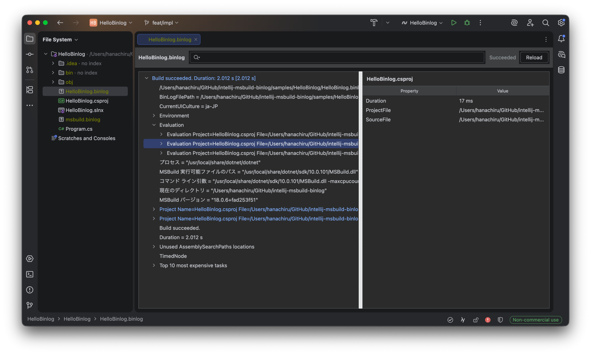

# MSBuild Binlog Viewer for Rider

[English README](README.md)

MSBuild Binlog Viewer for Rider は、`msbuild.binlog` を Rider 内の専用エディタで開き、ツリー表示とプロパティ表示で確認できるプラグインです。

## 機能

- `.binlog` を専用エディタで開く
- Build / Project / Target / Task / Message などをツリー表示する
- ツリーをテキストで絞り込む

## 必要環境

- Rider 2026.1 or newer
- .NET 10 or newer

## 使い方

1. Rider に plugin をインストールします。
2. `msbuild.binlog` を開きます。
